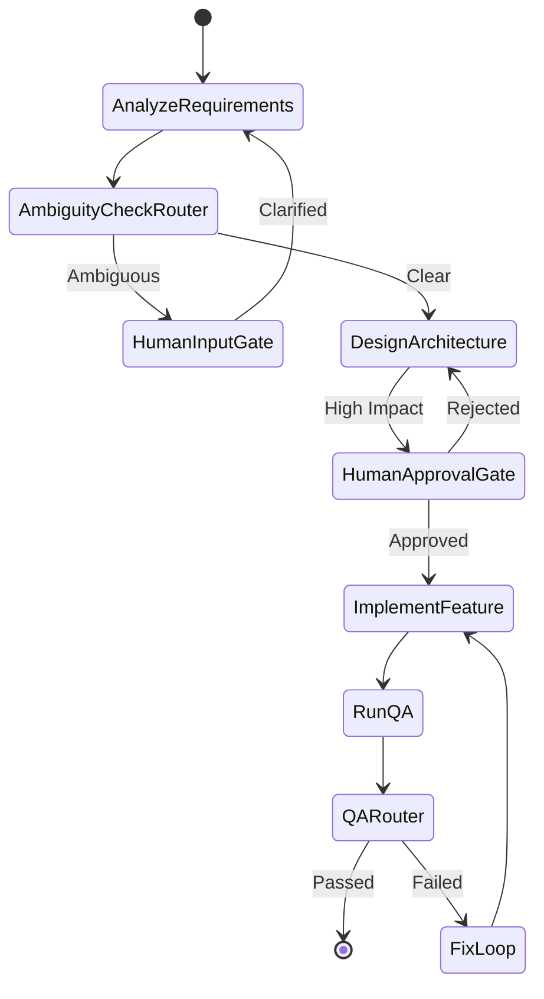

# Document 2: Agentic Orchestrator Architecture

## 1. System Overview

`Agentic Orchestrator` is a robust, non-linear Software Development Life Cycle (SDLC) automation framework. It moves beyond simple linear LLM prompt chains, utilizing an explicit stateful dependency graph to manage requirement analysis, architectural design, implementation, and Quality Assurance.

**Tech Stack**: Java 21, Spring Boot 4.1.0, Spring AI 2.0.0, React + Vite, H2 Database.

## 2. Stateful DAG Orchestration Model

The core differentiator of this system is the `SDLCWorkflowEngine`. Execution is not a single script, but a Directed Acyclic Graph (DAG) state machine.

### Control Flow

### Components

* **`NodeHandler`**: Atomic units of work (e.g., `AnalyzeRequirementsNode`). They utilize the Spring AI 2.0 `ChatClient` to perform complex generative tasks, utilizing specialized `ToolCallback` beans.
* **`EdgeRouter`**: Decision nodes that evaluate the `SDLCState` (e.g., "Did QA pass?") and determine the next node to execute. This allows for conditional branching and self-correction loops.
* **`SDLCState`**: A unified state object that preserves cross-stage context and decision lineage. It carries the requirements, generated codebase, test results, and audit logs throughout the lifecycle.

## 3. Resiliency, Governance & Controlled Autonomy

The system operates under the principle of **Controlled Autonomy**: Agents execute multi-step work, but humans provide oversight and final quality control.

### Human-In-The-Loop (HITL) Checkpoints

For high-impact actions (like finalizing the database schema or merging code), the orchestrator pauses at predefined gates (e.g., `HUMAN_APPROVAL_GATE`). Execution suspends, state is persisted, and the system waits for asynchronous human approval via the REST API before resuming.

### Safe-Stop Controls & Bounded Retries

To prevent infinite "hallucination loops", the system implements strict retry bounds:

* **Recursive Advising**: Uses Spring AI 2.0 `CallAdvisor` chains for iterative refinement.
* **Failure Thresholds**: If a test suite fails consecutively beyond a configured limit, the `EdgeRouter` triggers a `SAFE_STOP`, halting execution and flagging the issue for manual intervention.

## 4. Output Generation & Maintainability

The orchestrator leverages Spring AI's structured output converters to enforce JSON schemas on the LLM output. This ensures that when the `DesignArchitectureNode` yields an API definition, it is strictly typed and directly usable by the `ImplementFeatureNode` without parsing errors.

The resulting outputs are cleanly separated Maven Multi-Module projects, ensuring the generated codebase adheres to core engineering principles: modular, testable, and reliable.
