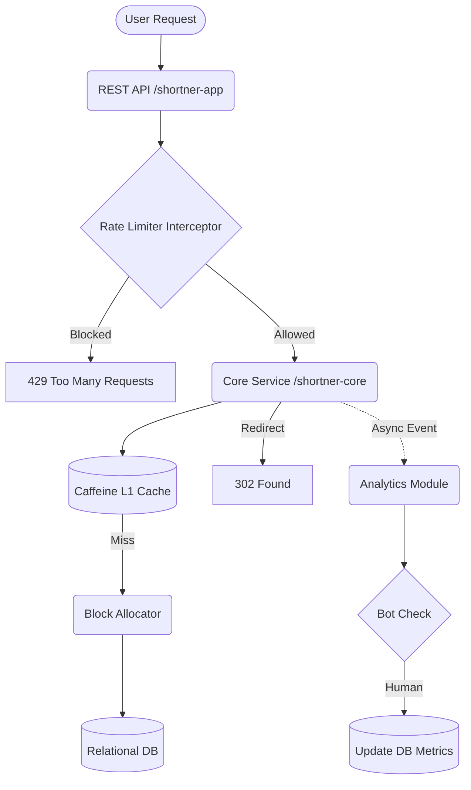

# Document 3: URL Shortener System Design & Production Readiness

## 1. Architecture Overview

The URL Shortener is engineered as a high-performance, enterprise-grade Spring Boot application utilizing a strict multi-module Maven architecture:

* `shortner-common`: Shared DTOs, Base62 Codecs, and Exception handlers.
* `shortner-core`: Core shortening and resolution domain logic.
* `shortner-analytics`: Decoupled, asynchronous click tracking.
* `shortner-app`: REST Controllers, UI, and Application bootstrappers.

## 2. Scalability & Performance Core Features

### Blazing Fast Redirects (The Block Allocator)

Standard database auto-increments create a bottleneck at high scale. To achieve maximum throughput, the system employs a **Block Allocator Mechanism**.

1. The service reserves a "block" of 1,000 IDs from the database using a pessimistic write lock (`FOR UPDATE`).
2. IDs are issued rapidly from application memory via an `AtomicLong`.
3. Millions of URLs can be generated per minute with virtually zero database contention.

### Multi-Tiered Caching

Resolution utilizes Caffeine L1 caching to ensure that frequently accessed short links are resolved entirely in memory, avoiding database I/O for read-heavy workloads.

### Decoupled Asynchronous Analytics

Click tracking occurs completely off the main thread to ensure redirect latency approaches 0ms.

* When a URL is accessed, a `UrlClickedEvent` is published using Spring Application Events.
* The controller immediately returns an HTTP `302 FOUND` to the user.
* A background thread (via `@Async` and `@TransactionalEventListener`) processes the click, computes the IP hash, and persists the analytics.

## 3. Security, Reliability & Risk Control

* **Rate Limiting**: To prevent bad actors from spamming the ID generator or enumerating short codes, a token-bucket interceptor restricts API usage based on IP and session.
* **Bot Mitigation**: The asynchronous analytics pipeline silently drops events triggered by known crawler user-agents (Googlebot, Discord, WhatsApp), keeping data pristine.

## 4. Engineering Trade-Offs & Limitations

1. **H2 vs. Testcontainers**: For frictionless evaluator testing, the `default` profile uses H2. However, a `prod` profile with `docker-compose.yml` (Postgres & Redis) is provided for true production-grade evaluation.
2. **POJOs vs. Lombok**: To guarantee zero friction on modern JDKs (Java 21+), standard getters/setters were chosen over Lombok, which occasionally has annotation processing issues on bleeding-edge environments.
3. **Monolith vs. Microservices**: A modular monolith was chosen. While easily splittable, deploying a simple URL shortener as 4 separate microservices introduces unnecessary operational complexity (network latency, distributed tracing overhead) at this stage.
